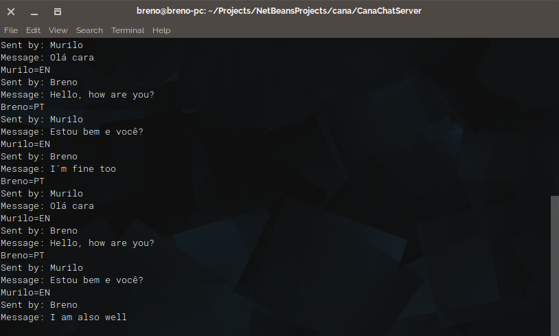

I created this icon just to learn a bit more how to use Inkscape.

## Description

Cana is a simple multi-user chat and works as follows: each user chooses a language that wants to receive the messages and the server will request the translations and send to the users according to with the language of chose. This projects uses the Google Translator API to do the translations.

This project for the Computer Networks course from the Federal University of Rio Grande do Norte (UFRN).

### Supported Languages

- Portuguese
- English
- Spanish
- German
- French
- Italian
- Dutch

## How to compile

#### Server

Open the project folder:

	cd CanaChatServer

To compile the chat server enter the following command:

	javac -cp lib/*.jar src/canachatserver/*.java

To generate the jar executable run the following command:

	jar cfm CanaChatServer.jar manifest.mf src/canachatserver/*.class

#### Client

Open the project folder:

	cd CanaChat

To compile the chat client enter the following command:

	javac src/canachat/*.java

To generate the jar executable run the following command:

	jar cfm CanaChat.jar manifest.mf src/canachat/*.class

## How to use

To run the chat server enter the following command:

	java -jar CanaChatServer.jar

And to run the chat client:

	java -jar CanaChat.jar

### Enter the chat

## Sample

### Client side

### Server side

