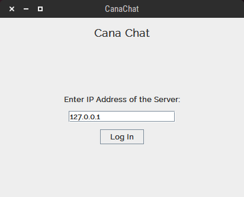
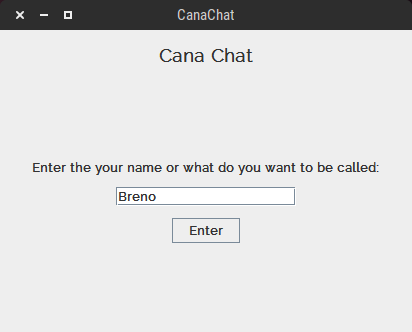
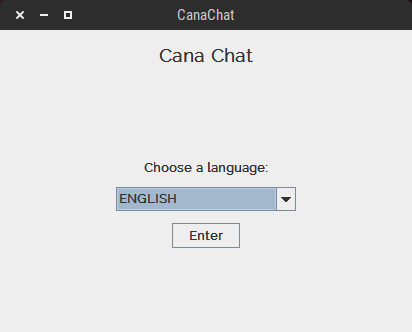
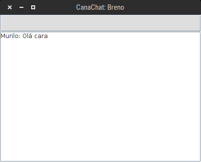
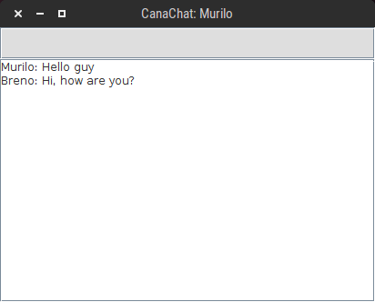
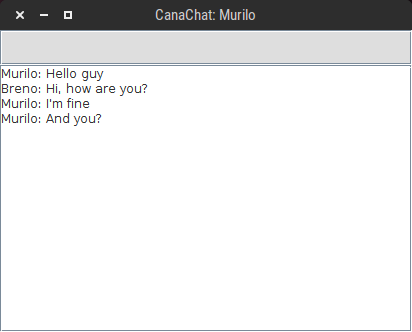
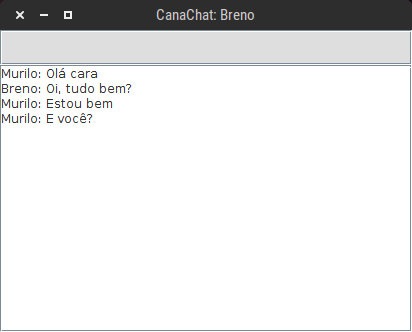

I created this icon just to learn a bit more how to use Inkscape.

## Description

Cana is a simple multi-user chat and works as follows: each user chooses a language that wants to receive the messages (just portuguese, english and spanish are supported in this version) and the server will request the translations and send to the users according to with the language of chose. This projects uses the Google Translator API to do the translations.

This project for the Computer Networks course from the Federal University of Rio Grande do Norte (UFRN).

## How to compile

#### Server

To compile the chat server enter the following command:

	cd CanaChatServer
	javac -cp lib/*.jar src/canachatserver/*.java

To generate the jar executable run the following command:

	jar cfm dist/CanaChatServer.jar manifest.mf src/canachatserver/*.class

#### Client

To compile the chat client enter the following command:

	cd CanaChat
	javac  src/canachat/*.java

To generate the jar executable run the following command:

	jar cfm dist/CanaChat.jar manifest.mf src/canachat/*.class

## How to use

To run the chat server enter the following command:

	java -jar dist/CanaChatServer.jar

And to run the chat client:

	java -jar dist/CanaChat.jar

#### 1. Enter the IP address of the server:

#### 2. Enter the client name:

#### 3. Enter the language:

## Preview

<!-- 

 -->

 

 

 
