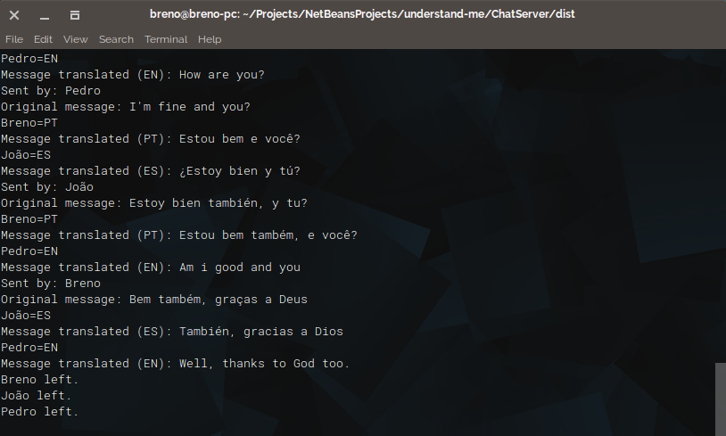

# Understand Me

## Description

**Understand Me** is a multi-user chat in which the user chooses a language they want to talk to and all messages from different languages will be translated into the language that this user has chosen. Each user must have a unique name, both for the chat server and for users to identify themselves in the conversation.

### How it works?

The translation is made from the Google Translate API. The user sends the message to the server that checks their language and applies the translation if necessary to send the message to each of the other users participating in the chat.

### Supported Languages

- Portuguese
- English
- Spanish
- German
- French
- Italian
- Dutch

## How to compile

#### Server

Open the project folder:

```bash
cd ChatServer
```

To compile the chat server enter the following command:

```bash
javac -cp lib/*.jar src/br/com/brenov/chatserver/*.java
```

To generate the jar executable run the following command:

```bash
jar cfm ChatServer.jar manifest.mf src/br/com/brenov/chatserver/*.class
```

#### Client

Open the project folder:

```bash
cd ChatClient
```

To compile the chat client enter the following command:

```bash
javac src/br/com/brenov/chatclient/*.java
```

To generate the jar executable run the following command:

```bash
jar cfm ChatClient.jar manifest.mf src/br/com/brenov/chatclient/*.class
```

## How to use

To run the chat server enter the following command:

```bash
java -jar ChatServer.jar $APIKEY
```

And to run the chat client:

```bash
java -jar ChatClient.jar
```

### Enter the chat

First, you need to enter the IP address, then the user should choose the language in which to talk and finally must choose a name for your server. From there you can send and receive messages in the chat.

<p align="center"></p>

## Sample

### Client side

<p align="center"></p>

### Server side

<p align="center"></p>

## Author

[](https://github.com/brenov) |
---|
[Breno Viana](https://github.com/brenov) |
